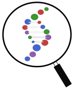

<!-- #  GeneFinder -->

[](https://www.repostatus.org/#wip)
[](https://camilogarciabotero.github.io/GeneFinder.jl/stable/)
[](https://camilogarciabotero.github.io/GeneFinder.jl/dev/)
[](https://travis-ci.com/camilogarciabotero/GeneFinder.jl)
[](https://github.com/camilogarciabotero/GeneFinder.jl/blob/main/LICENSE)

<!-- [](https://github.com/camilogarciabotero/GeneFinder.jl/actions/workflows/CI.yml?query=branch%3Amain) -->

***

[](https://codecov.io/gh/camilogarciabotero/GeneFinder.jl)

<!-- [](https://github.com/camilogarciabotero/GeneFinder.jl/actions/workflows/CI.yml) -->

<!-- [](https://github.com/JuliaTesting/Aqua.jl) -->

<!-- [](https://github.com/camilogarciabotero/GeneFinder.jl/actions?query=workflow%3A%22Unit+tests%22+branch%3Amain) -->


## Overview

>This is a species-agnostic, algorithm extensible, sequence-anonymous (genome, metagenomes) *gene finder* library for the Julia Language.

The main idea is to create versatile module that enables apply different implemented algorithm to DNA sequences. See the BioAlignment implementation of different sequence alignment algorithms (local, global, edit-distance).

## Installation

You can install GeneFinder from the julia REPL. Press `]` to enter pkg mode, and enter the following:

```
add https://github.com/camilogarciabotero/GeneFinder.jl
```

If you are interested in the cutting edge of the development, please check out
the master branch to try new features before release.

## Example

The first implemented function is `simplefinder` a very non-restrictive ORF finder function that will catch all ORFs in a dedicated structure. Note that this will catch random ORFs not necesarily genes since it has not ORFs size and overlapping condition contraints. Thus it might consider aa"M*" a posible encoding protein from the resulting ORFs.

```
julia> using BioSequences, GeneFinder

# > 180195.SAMN03785337.LFLS01000089 -> finds only 1 gene in Prodigal (from Pyrodigal tests)
seq = dna"AACCAGGGCAATATCAGTACCGCGGGCAATGCAACCCTGACTGCCGGCGGTAACCTGAACAGCACTGGCAATCTGACTGTGGGCGGTGTTACCAACGGCACTGCTACTACTGGCAACATCGCACTGACCGGTAACAATGCGCTGAGCGGTCCGGTCAATCTGAATGCGTCGAATGGCACGGTGACCTTGAACACGACCGGCAATACCACGCTCGGTAACGTGACGGCACAAGGCAATGTGACGACCAATGTGTCCAACGGCAGTCTGACGGTTACCGGCAATACGACAGGTGCCAACACCAACCTCAGTGCCAGCGGCAACCTGACCGTGGGTAACCAGGGCAATATCAGTACCGCAGGCAATGCAACCCTGACGGCCGGCGACAACCTGACGAGCACTGGCAATCTGACTGTGGGCGGCGTCACCAACGGCACGGCCACCACCGGCAACATCGCGCTGACCGGTAACAATGCACTGGCTGGTCCTGTCAATCTGAACGCGCCGAACGGCACCGTGACCCTGAACACAACCGGCAATACCACGCTGGGTAATGTCACCGCACAAGGCAATGTGACGACTAATGTGTCCAACGGCAGCCTGACAGTCGCTGGCAATACCACAGGTGCCAACACCAACCTGAGTGCCAGCGGCAATCTGACCGTGGGCAACCAGGGCAATATCAGTACCGCGGGCAATGCAACCCTGACTGCCGGCGGTAACCTGAGC"
```

```
julia> simplefinder(seq)

simplefinder(seq)
12-element Vector{ORF}:
 ORF(29:40, '+')
 ORF(137:145, '+')
 ORF(164:184, '+')
 ORF(173:184, '+')
 ORF(236:241, '+')
 ORF(248:268, '+')
 ORF(362:373, '+')
 ORF(470:496, '+')
 ORF(551:574, '+')
 ORF(569:574, '+')
 ORF(581:601, '+')
 ORF(695:706, '+')
```

Two other functions (`findcds` and `findproteins`) pass the sequence to `simplefinder` take the ORFs to index search the CDS and traslate into Protein: 

```
julia> findcds(seq)

12-element Vector{CDS}:
 CDS(ORF(29:40, '+'), ATGCAACCCTGA)
 CDS(ORF(137:145, '+'), ATGCGCTGA)
 CDS(ORF(164:184, '+'), ATGCGTCGAATGGCACGGTGA)
 CDS(ORF(173:184, '+'), ATGGCACGGTGA)
 CDS(ORF(236:241, '+'), ATGTGA)
 CDS(ORF(248:268, '+'), ATGTGTCCAACGGCAGTCTGA)
 CDS(ORF(362:373, '+'), ATGCAACCCTGA)
 CDS(ORF(470:496, '+'), ATGCACTGGCTGGTCCTGTCAATCTGA)
 CDS(ORF(551:574, '+'), ATGTCACCGCACAAGGCAATGTGA)
 CDS(ORF(569:574, '+'), ATGTGA)
 CDS(ORF(581:601, '+'), ATGTGTCCAACGGCAGCCTGA)
 CDS(ORF(695:706, '+'), ATGCAACCCTGA)
```


```
julia> findproteins(seq)
12-element Vector{Protein}:
 Protein(ORF(29:40, '+'), MQP*)
 Protein(ORF(137:145, '+'), MR*)
 Protein(ORF(164:184, '+'), MRRMAR*)
 Protein(ORF(173:184, '+'), MAR*)
 Protein(ORF(236:241, '+'), M*)
 Protein(ORF(248:268, '+'), MCPTAV*)
 Protein(ORF(362:373, '+'), MQP*)
 Protein(ORF(470:496, '+'), MHWLVLSI*)
 Protein(ORF(551:574, '+'), MSPHKAM*)
 Protein(ORF(569:574, '+'), M*)
 Protein(ORF(581:601, '+'), MCPTAA*)
 Protein(ORF(695:706, '+'), MQP*)
```
## Algorithms

### Coding genes (CDS - ORFs)

- [x] Simple finder (a simple ORF finder)
- [ ] EasyGene
- [ ] Prodigal - Pyrodigal
- [ ] PHANOTATE
- [ ] k-mer based gene finders (?)
- [ ] Augustus (?)

### Non-coding genes (RNA)

- [ ] Infernal
- [ ] tRNAscan

## Other features

- [ ] parallelism SIMD ?
- [ ] memory management (?)
- [ ] specialized types
  - [x] Gene
  - [x] ORF
  - [x] CDS
  - [ ] EukaryoticGene (?)
  - [ ] ProkaryoticGene (?)
  - [ ] Codon
  - [ ] Intron
  - [ ] Exon
  - [ ] GFF --> See other packages
  - [ ] FASTX --> See I/O in other packages

## Compatibilities  

Must interact with or extend:

- GenomicAnnotations.jl
- BioSequences.jl
- SequenceVariation.jl
- GenomicFeatures.jl
- FASTX.jl
- Kmers.jl
- HMMBase.jl
- Turing.jl
- MLJ.jl

## Contributing

## Citing

See [`CITATION.bib`](CITATION.bib) for the relevant reference(s).
