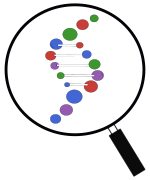

<p align="center">
  <br/>
  <i>A Gene Finder Framework for the Julia Programming Language.</i>
</p>

<div align="center">

[](https://camilogarciabotero.github.io/GeneFinder.jl/dev/)
[](https://github.com/camilogarciabotero/GeneFinder.jl/releases/latest)
[](https://doi.org/10.5281/zenodo.7519184)<br>
[](https://github.com/camilogarciabotero/GeneFinder.jl/actions/workflows/CI.yml)
[](https://github.com/camilogarciabotero/GeneFinder.jl/blob/main/LICENSE)
[](https://www.repostatus.org/#wip)
[](http://juliapkgstats.com/pkg/GeneFinder)
[](https://github.com/JuliaTesting/Aqua.jl)

</div>

***

## Overview

> This is a species-agnostic, algorithm extensible, sequence-anonymous (genome, metagenomes) *gene finder* library framework for the Julia Language.

The `GeneFinder` package provides a versatile framework for finding Open Reading Frames (ORFs) in DNA sequences. It offers a common interface for different gene finding algorithms and returns results as `ORFCollection` objects that bundle ORFs with their source sequence for clean sequence extraction.

> [!WARNING] 
> This package is currently under development and the API is subject to change.

## Installation

You can install `GeneFinder` from the Julia REPL. Press `]` to enter pkg mode:

```julia-repl
julia> add GeneFinder
```

## Quick Start

```julia-repl
julia> using BioSequences, GeneFinder

seq = dna"ATGATGCATGCATGCATGCTAGTAACTAGCTAGCTAGCTAGTAA";
collection = findorfs(seq) # Find all ORFs - returns an ORFCollection

ORFCollection{NaiveFinder} with 5 ORFs in 44bp sequence:
 ORF{NaiveFinder}(1:33, '+', 1)
 ORF{NaiveFinder}(4:33, '+', 1)
 ORF{NaiveFinder}(8:22, '+', 2)
 ORF{NaiveFinder}(12:29, '+', 3)
 ORF{NaiveFinder}(16:33, '+', 1)
```

## Finding ORFs

The main function is `findorfs`, which uses the `NaiveFinder` algorithm by default:

```julia-repl
julia> using BioSequences, GeneFinder

julia> seq = dna"AACCAGGGCAATATCAGTACCGCGGGCAATGCAACCCTGACTGCCGGCGGTAACCTGAACAGCACTGGCAATCTGACTGTGGGCGGTGTTACCAACGGCACTGCTACTACTGGCAACATCGCACTGACCGGTAACAATGCGCTGAGCGGTCCGGTCAATCTGAATGCGTCGAATGGCACGGTGACCTTGAACACGACCGGCAATACCACGCTCGGTAACGTGACGGCACAAGGCAATGTGACGACCAATGTGTCCAACGGCAGTCTGACGGTTACCGGCAATACGACAGGTGCCAACACCAACCTCAGTGCCAGCGGCAACCTGACCGTGGGTAACCAGGGCAATATCAGTACCGCAGGCAATGCAACCCTGACGGCCGGCGACAACCTGACGAGCACTGGCAATCTGACTGTGGGCGGCGTCACCAACGGCACGGCCACCACCGGCAACATCGCGCTGACCGGTAACAATGCACTGGCTGGTCCTGTCAATCTGAACGCGCCGAACGGCACCGTGACCCTGAACACAACCGGCAATACCACGCTGGGTAATGTCACCGCACAAGGCAATGTGACGACTAATGTGTCCAACGGCAGCCTGACAGTCGCTGGCAATACCACAGGTGCCAACACCAACCTGAGTGCCAGCGGCAATCTGACCGTGGGCAACCAGGGCAATATCAGTACCGCGGGCAATGCAACCCTGACTGCCGGCGGTAACCTGAGC";

julia> collection = findorfs(seq, finder = NaiveFinder)
ORFCollection{NaiveFinder} with 12 ORFs in 726bp sequence:
 ORF{NaiveFinder}(29:40, '+', 2)
 ORF{NaiveFinder}(137:145, '+', 2)
 ORF{NaiveFinder}(164:184, '+', 2)
 ORF{NaiveFinder}(173:184, '+', 2)
 ORF{NaiveFinder}(236:241, '+', 2)
 ORF{NaiveFinder}(248:268, '+', 2)
 ORF{NaiveFinder}(362:373, '+', 2)
 ORF{NaiveFinder}(470:496, '+', 2)
 ORF{NaiveFinder}(551:574, '+', 2)
 ORF{NaiveFinder}(569:574, '+', 2)
 ⋮
 ORF{NaiveFinder}(695:706, '+', 2)
```

> [!NOTE] 
> The `minlen` kwarg defaults to 6nt, so short ORFs like `dna"ATGTGA"` → `aa"M*"` may be detected.

## Working with ORFCollection

The `ORFCollection` bundles ORFs with their source sequence:

```julia-repl
# Access ORFs
julia> collection[1]           # First ORF
ORF{NaiveFinder}(29:40, '+', 2)

julia> collection[1:5]         # Range of ORFs
5-element Vector{OpenReadingFrame{NaiveFinder}}: # Note that subseting returns a vector
 ORF{NaiveFinder}(29:40, '+', 2)
 ORF{NaiveFinder}(137:145, '+', 2)
 ORF{NaiveFinder}(164:184, '+', 2)
 ORF{NaiveFinder}(173:184, '+', 2)
 ORF{NaiveFinder}(236:241, '+', 2)

julia> length(collection)      # Number of ORFs
12


julia> src = source(collection) # Get source sequence
726nt DNA Sequence:
AACCAGGGCAATATCAGTACCGCGGGCAATGCAACCCTG…GCGGGCAATGCAACCCTGACTGCCGGCGGTAACCTGAGC
```

## Extracting Sequences

```julia-repl
julia> orfseq = sequence(collection, 1) # By index
12nt DNA Sequence:
ATGCAACCCTGA


julia> orf = collection[1]; orfseq = sequence(collection, orf) # By ORF
12nt DNA Sequence:
ATGCAACCCTGA

julia> all_orfs_seqs = sequence.(Ref(collection), collection.orfs) # All sequences at once
12-element Vector{LongSubSeq{DNAAlphabet{4}}}:
 ATGCAACCCTGA
 ATGCGCTGA
 ATGCGTCGAATGGCACGGTGA
 ATGGCACGGTGA
 ATGTGA
 ATGTGTCCAACGGCAGTCTGA
 ATGCAACCCTGA
 ATGCACTGGCTGGTCCTGTCAATCTGA
 ATGTCACCGCACAAGGCAATGTGA
 ATGTGA
 ATGTGTCCAACGGCAGCCTGA
 ATGCAACCCTGA
```

## Translation

Using `BioSequences.translate` on extracted sequences:

```julia-repl
julia> protein = translate(sequence(collection, 1)) # Single ORF
4aa Amino Acid Sequence:
MQP*

julia> proteins = translate.(sequence.(Ref(collection), collection)) # All ORFs
12-element Vector{LongAA}:
 MQP*
 MR*
 MRRMAR*
 MAR*
 M*
 MCPTAV*
 MQP*
 MHWLVLSI*
 MSPHKAM*
 M*
 MCPTAA*
 MQP*
```

## Scoring ORFs

ORF sequences can be scored using the log-odds ratio approach from [BioMarkovChains.jl](https://github.com/camilogarciabotero/BioMarkovChains.jl):

```julia-repl
julia> using BioMarkovChains

julia> orfseqs = sequence.(Ref(collection), collection); # Extract sequences

julia> scores = log_odds_ratio_score.(orfseqs)
12-element Vector{Float64}:
 0.469404606944017
 1.0174520899042823
 1.5914902556997463
 0.9772187907841964
 0.6106494455192994
 0.7089167973379216
 0.469404606944017
 1.5523291911446804
 0.5282685400427601
 0.6106494455192994
 0.7405746713921604
 0.469404606944017
```

Check if sequences are likely coding using a conding decision rule, check the `iscoding` function:

```julia-repl
julia> iscoding(sequence(collection, 1)) # Check individual sequence
true

julia> orfseqs = sequence.(Ref(collection), collection); # Check all sequences
julia> coding_bit_mask = iscoding.(orfseqs)
12-element BitVector:
 1
 1
 1
 1
 1
 1
 1
 1
 1
 1
 1
 1

# Filter for coding ORFs
julia> codingorfs = collection[coding_bit_mask]

12-element Vector{OpenReadingFrame{NaiveFinder}}:
 ORF{NaiveFinder}(29:40, '+', 2)
 ORF{NaiveFinder}(137:145, '+', 2)
 ORF{NaiveFinder}(164:184, '+', 2)
 ORF{NaiveFinder}(173:184, '+', 2)
 ORF{NaiveFinder}(236:241, '+', 2)
 ORF{NaiveFinder}(248:268, '+', 2)
 ORF{NaiveFinder}(362:373, '+', 2)
 ORF{NaiveFinder}(470:496, '+', 2)
 ORF{NaiveFinder}(551:574, '+', 2)
 ORF{NaiveFinder}(569:574, '+', 2)
 ORF{NaiveFinder}(581:601, '+', 2)
 ORF{NaiveFinder}(695:706, '+', 2)
```

## Writing to Files

GeneFinder supports exporting ORFs in multiple formats:
<div align="center">

| Function | Description |
|----------|-------------|
| `write_orfs_fna` | Nucleotide sequences (FASTA) |
| `write_orfs_faa` | Amino acid sequences (FASTA) |
| `write_orfs_bed` | BED format |
| `write_orfs_gff` | GFF3 format |

</div>

Example:

```julia-repl
julia> open("output.fna", "w") do io
          write_orfs_fna(seq, io; finder=NaiveFinder) # Write nucleotide FASTA
       end

julia> open("output.faa", "w") do io
          write_orfs_faa(seq, io; finder=NaiveFinder) # Write amino acid FASTA
       end


julia> open("output.gff", "w") do io
          write_orfs_gff(seq, io; finder=NaiveFinder, seqname="myseq") # Write GFF3
       end
```

Output (FASTA):
```
>ORF01 id=01 start=29 stop=40 strand=+ frame=2 features=[]
ATGCAACCCTGA
>ORF02 id=02 start=137 stop=145 strand=+ frame=2 features=[]
ATGCGCTGA
⋮
```

## Alternative Start Codons

Use `alternative_start=true` to include GTG, TTG, and CTG as start codons:

```julia
collection = findorfs(seq, finder=NaiveFinder, alternative_start=true)
```

## Available Algorithms

| Algorithm | Description |
|-----------|-------------|
| `NaiveFinder` | Regex-based ORF detection (default) |
| `NaiveFinderLazy` | Memory-optimized variant with pre-allocation |
| `NaiveCollector` | Uses simple `eachmatch` for non-overlapping ORF detection |

## Documentation

For more details, see the [full documentation](https://camilogarciabotero.github.io/GeneFinder.jl/dev/).

## Citation

If you use GeneFinder in your research, please cite:

[](https://doi.org/10.5281/zenodo.7519184)
