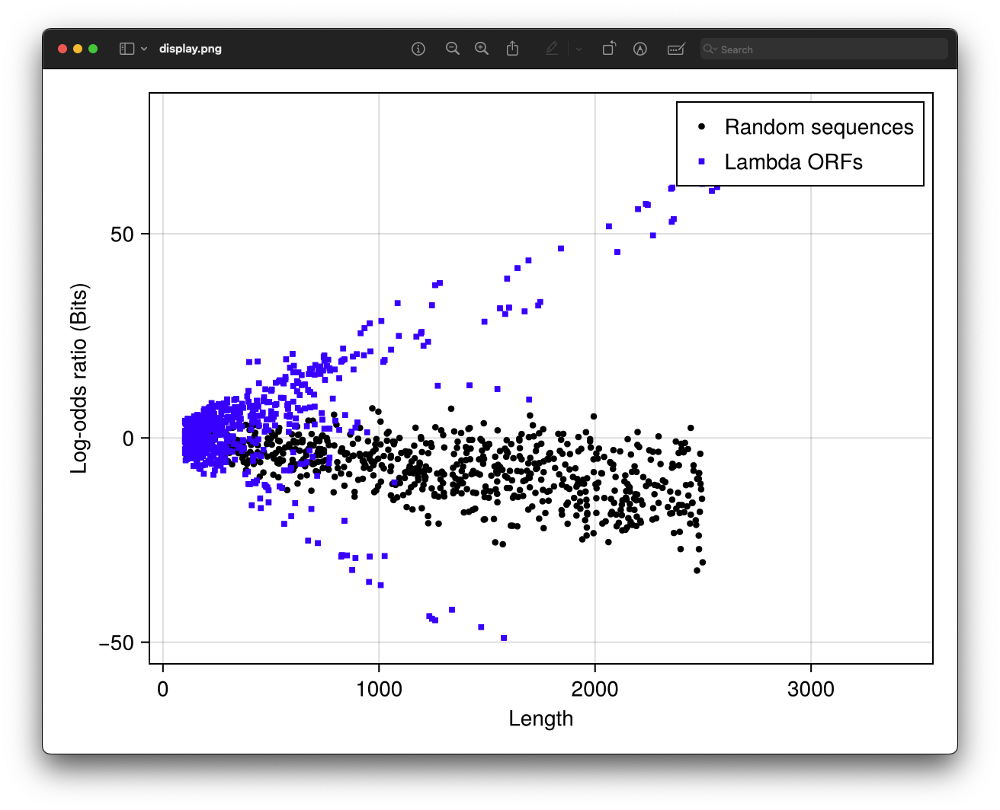

## The ORF features

The `ORF` type is designed to be flexible and can store various types of information about the ORF. This versatility allows it to hold data such as a score of an ORF based on a scoring function, the sequence of the ORF, or even the translated amino acid sequence. For example, in the `NaiveFinder` method, the `score` subfield is used to store the score of the ORF using an scoring scheme (i.e. a function).

```julia
phi = dna"GTGTGAGGTTATAACGCCGAAGCGGTAAAAATTTTAATTTTTGCCGCTGAGGGGTTGACCAAGCGAAGCGCGGTAGGTTTTCTGCTTAGGAGTTTAATCATGTTTCAGACTTTTATTTCTCGCCATAATTCAAACTTTTTTTCTGATAAGCTGGTTCTCACTTCTGTTACTCCAGCTTCTTCGGCACCTGTTTTACAGACACCTAAAGCTACATCGTCAACGTTATATTTTGATAGTTTGACGGTTAATGCTGGTAATGGTGGTTTTCTTCATTGCATTCAGATGGATACATCTGTCAACGCCGCTAATCAGGTTGTTTCTGTTGGTGCTGATATTGCTTTTGATGCCGACCCTAAATTTTTTGCCTGTTTGGTTCGCTTTGAGTCTTCTTCGGTTCCGACTACCCTCCCGACTGCCTATGATGTTTATCCTTTGAATGGTCGCCATGATGGTGGTTATTATACCGTCAAGGACTGTGTGACTATTGACGTCCTTCCCCGTACGCCGGGCAATAACGTTTATGTTGGTTTCATGGTTTGGTCTAACTTTACCGCTACTAAATGCCGCGGATTGGTTTCGCTGAATCAGGTTATTAAAGAGATTATTTGTCTCCAGCCACTTAAGTGAGGTGATTTATGTTTGGTGCTATTGCTGGCGGTATTGCTTCTGCTCTTGCTGGTGGCGCCATGTCTAAATTGTTTGGAGGCGGTCAAAAAGCCGCCTCCGGTGGCATTCAAGGTGATGTGCTTGCTACCGATAACAATACTGTAGGCATGGGTGATGCTGGTATTAAATCTGCCATTCAAGGCTCTAATGTTCCTAACCCTGATGAGGCCGCCCCTAGTTTTGTTTCTGGTGCTATGGCTAAAGCTGGTAAAGGACTTCTTGAAGGTACGTTGCAGGCTGGCACTTCTGCCGTTTCTGATAAGTTGCTTGATTTGGTTGGACTTGGTGGCAAGTCTGCCGCTGATAAAGGAAAGGATACTCGTGATTATCTTGCTGCTGCATTTCCTGAGCTTAATGCTTGGGAGCGTGCTGGTGCTGATGCTTCCTCTGCTGGTATGGTTGACGCCGGATTTGAGAATCAAAAAGAGCTTACTAAAATGCAACTGGACAATCAGAAAGAGATTGCCGAGATGCAAAATGAGACTCAAAAAGAGATTGCTGGCATTCAGTCGGCGACTTCACGCCAGAATACGAAAGACCAGGTATATGCACAAAATGAGATGCTTGCTTATCAACAGAAGGAGTCTACTGCTCGCGTTGCGTCTATTATGGAAAACACCAATCTTTCCAAGCAACAGCAGGTTTCCGAGATTATGCGCCAAATGCTTACTCAAGCTCAAACGGCTGGTCAGTATTTTACCAATGACCAAATCAAAGAAATGACTCGCAAGGTTAGTGCTGAGGTTGACTTAGTTCATCAGCAAACGCAGAATCAGCGGTATGGCTCTTCTCATATTGGCGCTACTGCAAAGGATATTTCTAATGTCGTCACTGATGCTGCTTCTGGTGTGGTTGATATTTTTCATGGTATTGATAAAGCTGTTGCCGATACTTGGAACAATTTCTGGAAAGACGGTAAAGCTGATGGTATTGGCTCTAATTTGTCTAGGAAATAACCGTCAGGATTGACACCCTCCCAATTGTATGTTTTCATGCCTCCAAATCTTGGAGGCTTTTTTATGGTTCGTTCTTATTACCCTTCTGAATGTCACGCTGATTATTTTGACTTTGAGCGTATCGAGGCTCTTAAACCTGCTATTGAGGCTTGTGGCATTTCTACTCTTTCTCAATCCCCAATGCTTGGCTTCCATAAGCAGATGGATAACCGCATCAAGCTCTTGGAAGAGATTCTGTCTTTTCGTATGCAGGGCGTTGAGTTCGATAATGGTGATATGTATGTTGACGGCCATAAGGCTGCTTCTGACGTTCGTGATGAGTTTGTATCTGTTACTGAGAAGTTAATGGATGAATTGGCACAATGCTACAATGTGCTCCCCCAACTTGATATTAATAACACTATAGACCACCGCCCCGAAGGGGACGAAAAATGGTTTTTAGAGAACGAGAAGACGGTTACGCAGTTTTGCCGCAAGCTGGCTGCTGAACGCCCTCTTAAGGATATTCGCGATGAGTATAATTACCCCAAAAAGAAAGGTATTAAGGATGAGTGTTCAAGATTGCTGGAGGCCTCCACTATGAAATCGCGTAGAGGCTTTGCTATTCAGCGTTTGATGAATGCAATGCGACAGGCTCATGCTGATGGTTGGTTTATCGTTTTTGACACTCTCACGTTGGCTGACGACCGATTAGAGGCGTTTTATGATAATCCCAATGCTTTGCGTGACTATTTTCGTGATATTGGTCGTATGGTTCTTGCTGCCGAGGGTCGCAAGGCTAATGATTCACACGCCGACTGCTATCAGTATTTTTGTGTGCCTGAGTATGGTACAGCTAATGGCCGTCTTCATTTCCATGCGGTGCACTTTATGCGGACACTTCCTACAGGTAGCGTTGACCCTAATTTTGGTCGTCGGGTACGCAATCGCCGCCAGTTAAATAGCTTGCAAAATACGTGGCCTTATGGTTACAGTATGCCCATCGCAGTTCGCTACACGCAGGACGCTTTTTCACGTTCTGGTTGGTTGTGGCCTGTTGATGCTAAAGGTGAGCCGCTTAAAGCTACCAGTTATATGGCTGTTGGTTTCTATGTGGCTAAATACGTTAACAAAAAGTCAGATATGGACCTTGCTGCTAAAGGTCTAGGAGCTAAAGAATGGAACAACTCACTAAAAACCAAGCTGTCGCTACTTCCCAAGAAGCTGTTCAGAATCAGAATGAGCCGCAACTTCGGGATGAAAATGCTCACAATGACAAATCTGTCCACGGAGTGCTTAATCCAACTTACCAAGCTGGGTTACGACGCGACGCCGTTCAACCAGATATTGAAGCAGAACGCAAAAAGAGAGATGAGATTGAGGCTGGGAAAAGTTACTGTAGCCGACGTTTTGGCGGCGCAACCTGTGACGACAAATCTGCTCAAATTTATGCGCGCTTCGATAAAAATGATTGGCGTATCCAACCTGCAGAGTTTTATCGCTTCCATGACGCAGAAGTTAACACTTTCGGATATTTCTGATGAGTCGAAAAATTATCTTGATAAAGCAGGAATTACTACTGCTTGTTTACGAATTAAATCGAAGTGGACTGCTGGCGGAAAATGAGAAAATTCGACCTATCCTTGCGCAGCTCGAGAAGCTCTTACTTTGCGACCTTTCGCCATCAACTAACGATTCTGTCAAAAACTGACGCGTTGGATGAGGAGAAGTGGCTTAATATGCTTGGCACGTTCGTCAAGGACTGGTTTAGATATGAGTCACATTTTGTTCATGGTAGAGATTCTCTTGTTGACATTTTAAAAGAGCGTGGATTACTATCTGAGTCCGATGCTGTTCAACCACTAATAGGTAAGAAATCATGAGTCAAGTTACTGAACAATCCGTACGTTTCCAGACCGCTTTGGCCTCTATTAAGCTCATTCAGGCTTCTGCCGTTTTGGATTTAACCGAAGATGATTTCGATTTTCTGACGAGTAACAAAGTTTGGATTGCTACTGACCGCTCTCGTGCTCGTCGCTGCGTTGAGGCTTGCGTTTATGGTACGCTGGACTTTGTGGGATACCCTCGCTTTCCTGCTCCTGTTGAGTTTATTGCTGCCGTCATTGCTTATTATGTTCATCCCGTCAACATTCAAACGGCCTGTCTCATCATGGAAGGCGCTGAATTTACGGAAAACATTATTAATGGCGTCGAGCGTCCGGTTAAAGCCGCTGAATTGTTCGCGTTTACCTTGCGTGTACGCGCAGGAAACACTGACGTTCTTACTGACGCAGAAGAAAACGTGCGTCAAAAATTACGTGCGGAAGGAGTGATGTAATGTCTAAAGGTAAAAAACGTTCTGGCGCTCGCCCTGGTCGTCCGCAGCCGTTGCGAGGTACTAAAGGCAAGCGTAAAGGCGCTCGTCTTTGGTATGTAGGTGGTCAACAATTTTAATTGCAGGGGCTTCGGCCCCTTACTTGAGGATAAATTATGTCTAATATTCAAACTGGCGCCGAGCGTATGCCGCATGACCTTTCCCATCTTGGCTTCCTTGCTGGTCAGATTGGTCGTCTTATTACCATTTCAACTACTCCGGTTATCGCTGGCGACTCCTTCGAGATGGACGCCGTTGGCGCTCTCCGTCTTTCTCCATTGCGTCGTGGCCTTGCTATTGACTCTACTGTAGACATTTTTACTTTTTATGTCCCTCATCGTCACGTTTATGGTGAACAGTGGATTAAGTTCATGAAGGATGGTGTTAATGCCACTCCTCTCCCGACTGTTAACACTACTGGTTATATTGACCATGCCGCTTTTCTTGGCACGATTAACCCTGATACCAATAAAATCCCTAAGCATTTGTTTCAGGGTTATTTGAATATCTATAACAACTATTTTAAAGCGCCGTGGATGCCTGACCGTACCGAGGCTAACCCTAATGAGCTTAATCAAGATGATGCTCGTTATGGTTTCCGTTGCTGCCATCTCAAAAACATTTGGACTGCTCCGCTTCCTCCTGAGACTGAGCTTTCTCGCCAAATGACGACTTCTACCACATCTATTGACATTATGGGTCTGCAAGCTGCTTATGCTAATTTGCATACTGACCAAGAACGTGATTACTTCATGCAGCGTTACCATGATGTTATTTCTTCATTTGGAGGTAAAACCTCTTATGACGCTGACAACCGTCCTTTACTTGTCATGCGCTCTAATCTCTGGGCATCTGGCTATGATGTTGATGGAACTGACCAAACGTCGTTAGGCCAGTTTTCTGGTCGTGTTCAACAGACCTATAAACATTCTGTGCCGCGTTTCTTTGTTCCTGAGCATGGCACTATGTTTACTCTTGCGCTTGTTCGTTTTCCGCCTACTGCGACTAAAGAGATTCAGTACCTTAACGCTAAAGGTGCTTTGACTTATACCGATATTGCTGGCGACCCTGTTTTGTATGGCAACTTGCCGCCGCGTGAAATTTCTATGAAGGATGTTTTCCGTTCTGGTGATTCGTCTAAGAAGTTTAAGATTGCTGAGGGTCAGTGGTATCGTTATGCGCCTTCGTATGTTTCTCCTGCTTATCACCTTCTTGAAGGCTTCCCATTCATTCAGGAACCGCCTTCTGGTGATTTGCAAGAACGCGTACTTATTCGCCACCATGATTATGACCAGTGTTTCCAGTCCGTTCAGTTGTTGCAGTGGAATAGTCAGGTTAAATTTAATGTGACCGTTTATCGCAATCTGCCGACCACTCGCGATTCAATCATGACTTCGTGATAAAAGATTGA"

phiorfs = findorfs(phi, finder=NaiveFinder, minlen=75, scheme=lors)

124-element Vector{ORF{4, NaiveFinder}}:
 ORF{NaiveFinder}(9:101, '-', 3)
 ORF{NaiveFinder}(100:627, '+', 1)
 ORF{NaiveFinder}(223:447, '-', 1)
 ORF{NaiveFinder}(248:436, '+', 2)
 ORF{NaiveFinder}(257:436, '+', 2)
 ORF{NaiveFinder}(283:627, '+', 1)
 ORF{NaiveFinder}(344:436, '+', 2)
 ORF{NaiveFinder}(532:627, '+', 1)
 ORF{NaiveFinder}(636:1622, '+', 3)
 ORF{NaiveFinder}(687:1622, '+', 3)
 ORF{NaiveFinder}(774:1622, '+', 3)
 ORF{NaiveFinder}(781:1389, '+', 1)
 ORF{NaiveFinder}(814:1389, '+', 1)
 ORF{NaiveFinder}(829:1389, '+', 1)
 ORF{NaiveFinder}(861:1622, '+', 3)
 ⋮
 ORF{NaiveFinder}(4671:5375, '+', 3)
 ORF{NaiveFinder}(4690:4866, '+', 1)
 ORF{NaiveFinder}(4728:5375, '+', 3)
 ORF{NaiveFinder}(4741:4866, '+', 1)
 ORF{NaiveFinder}(4744:4866, '+', 1)
 ORF{NaiveFinder}(4777:4866, '+', 1)
 ORF{NaiveFinder}(4806:5375, '+', 3)
 ORF{NaiveFinder}(4863:5258, '-', 3)
 ORF{NaiveFinder}(4933:5019, '+', 1)
 ORF{NaiveFinder}(4941:5375, '+', 3)
 ORF{NaiveFinder}(5082:5375, '+', 3)
 ORF{NaiveFinder}(5089:5325, '+', 1)
 ORF{NaiveFinder}(5122:5202, '-', 1)
 ORF{NaiveFinder}(5152:5325, '+', 1)
 ORF{NaiveFinder}(5164:5325, '+', 1)
```

In the example above we calculated a score using the `lors` scoring scheme (see [lors](https://github.com/camilogarciabotero/BioMarkovChains.jl/blob/533e53d97cf5951f1ca050454bce1423ec8d7c36/src/transitions.jl#L179) from the [BioMarkovChains.jl](https://camilogarciabotero.github.io/BioMarkovChains.jl/dev/) package). The score is stored in the `score` subfield of the `ORF` .

All features can be accesed using a conviniente funciton called `features` that returns a `NamedTuple` with the features of the `ORF` and can be broadcasted to the entire collection of `ORF`s using the `.` syntax.

```julia
features.(phiorfs)

124-element Vector{@NamedTuple{score::Float64}}:
 (score = -3.002461366087374,)
 (score = -10.814621287968222,)
 (score = -5.344187934894264,)
 (score = -1.316724559874126,)
 (score = -1.796631200562138,)
 (score = -3.2651518608269856,)
 (score = -1.4019264441082822,)
 (score = -2.3192349590107475,)
 (score = 5.055524446434241,)
 (score = 2.7116397224896436,)
 (score = 2.2564640592402165,)
 (score = 1.777499581940097,)
 (score = 2.3474811908011186,)
 (score = 2.38568188352799,)
 (score = 2.498608044469827,)
 ⋮
 (score = -5.474837954151803,)
 (score = 0.6909362932156138,)
 (score = -5.900045211699447,)
 (score = 1.2010656615619415,)
 (score = 0.8541931309205604,)
 (score = 2.7897961643147777,)
 (score = -4.42890346770467,)
 (score = -5.40624241726446,)
 (score = -0.8080572222081075,)
 (score = -5.571494087742448,)
 (score = -4.882156920421228,)
 (score = -5.639670353834974,)
 (score = -0.8764121443326865,)
 (score = -4.308687693802273,)
 (score = -4.459423419810693,)
```

## Analysing Lambda ORFs

In this case the `lors` calculates the log odds ratio of the ORF sequence given two Markov models (by default: [ECOLICDS](https://github.com/camilogarciabotero/BioMarkovChains.jl/blob/533e53d97cf5951f1ca050454bce1423ec8d7c36/src/models.jl#L3) and [ECOLINOCDS](https://github.com/camilogarciabotero/BioMarkovChains.jl/blob/533e53d97cf5951f1ca050454bce1423ec8d7c36/src/models.jl#L16)), one for the coding region and one for the non-coding region. The score is stored in the `score` field of the `NamedTuple` returned by the `features` function. By default the `lors` function return the base 2 logarithm of the odds ratio, so it is analogous to the bits of information that the ORF sequence is coding.

Now we can even analyse how is the distribution of the ORFs' scores as a function of their lengths compared to random sequences.

```julia
lambda = fasta2bioseq("test/data/NC_001416.1.fasta")[1]

lambaorfs = findorfs(lambda, finder=NaiveFinder, minlen=100, scheme=lors)

lamdascores = score.(lambaorfs)
lambdalengths = length.(lambaorfs)

## get some random sequences of variable lengths
vseqs = LongDNA[]
for i in 1:708
    push!(vseqs, randdnaseq(rand(100:2500)))
end

## get the lengths and scores of the random generated sequences
randlengths = length.(vseqs)
randscores = lors.(vseqs)

## plot the scores as a function of the lengths
using CairoMakie

f = Figure()
ax = Axis(f[1, 1], xlabel="Length", ylabel="Log-odds ratio (Bits)")

scatter!(ax,
    randlengths,
    randscores,
    marker = :circle, 
    markersize = 6, 
    color = :black, 
    label = "Random sequences"
)
scatter!(ax,
    lambdalengths, 
    lambdascores, 
    marker = :rect, 
    markersize = 6, 
    color = :blue, 
    label = "Lambda ORFs"
)

axislegend(ax)

f
```



What this plot shows is that the ORFs in the lambda genome have a higher scores than random sequences of the same length. The score is a measure of how likely a sequence given the coding model is compared to the non-coding model. In other words, the higher the score the more likely the sequence is coding. So, the plot shows that the ORFs in the lambda genome are more likely to be coding regions than random sequences. It also shows that the longer the ORF the higher the score, which is expected since longer ORFs are more likely to be coding regions than shorter ones.


