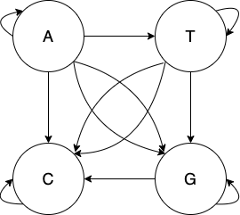

# DNA as a Markov chain

Several packages (e.g. [MarkovChainsHammer.kl](https://github.com/sandreza/MarkovChainHammer.jl), [DiscreteMarkovChains.jl](https://github.com/Maelstrom6/DiscreteMarkovChains.jl), etc.) in
the Julia ecosystem have been implemented to work with Markov chains
with a *state space* of integers, those could be efficient in many ways,
but they are clumsy to work with a specialized biological types as in
the `BioJulia` ecosystem. Therefore, in the `GeneFinder` package we
dedicated some implementations to work with `BioSequence` types so that
we can expand the functionality in an efficient way (see complete
[API](https://camilogarciabotero.github.io/GeneFinder.jl/dev/api/)).

One important step towards many gene finding algorithms is to represent
a DNA sequence as a Markov chain. In this representation a DNA sequence
of a reduced alphabet ``𝒜 = {A,  C,  G ,  T}`` is draw as a four-vertex
graph, where each letter of 𝒜 is a *state (vertex)* and the edges of the
graph represent *transitions* from one nucleotide to another in a
sequence (e.g. ``A \rightarrow T`` represent a single nucleotide to nucleotide
transition). This is also considered more specifically as a Discrete
Markov chain (Axelson-Fisk 2015). The complete set of transitions and
states of a DNA sequence of alphabet 𝒜.



More formally a Markov chain is a random process where each state is a
random variable `X_t` where `t \in T` is a discrete time in a finite
sequence *T* and the probability to jump from one state into another is
*only dependent of the current state.* Therefore a definition of this
*Markov property* is given by:

``` math
\begin{align}
P(X_{t} = j |X_{t−1} = i)
\end{align}
```

where *i*, *j* ∈ 𝒜 . This property led us to generalize a way to
calculate the probability of a sequence *T* from a process
`(X_{1}...X_{T})` where each random variable is a nucleotide from 𝒜 so
that:

``` math
\begin{align}
P(X_{1} = i_{1},...,X_{T} = i_{T}) = P(X_{1} = i_{1}) \prod_{t=2}^{T} P(X_{t} = i_{t} | X_{t−1} = i_{t−1})
\end{align}
```

Note that previous equations has two terms, a initial probability
``P(X_{1} = i_{1})`` and the the product of all transitions beginning at
``t=2``. So, to calculate the initial probability distribution of each of
the nucleotides of a string ``T`` with the alphabet 𝒜 we can first
calculate the transition probability matrix ℳ̂ out of the frequency count
of the transitions. In an alphabet 𝒜 we got ``4^2`` transitions of
one order, that is the ``AA, AC, AG, ...`` which coincides with
the frequency of the dinucleotides in the sequence. So we can later in
fact build a ``4 x 4`` matrix representing all the transitions. For instance
in a DNA sequence ``T`` of 24 nucleotides:  

``` math
CCTCCCGGACCCTGGGCTCGGGAC
```

We can calculate each frequency nucleotide to any other nucleotide
``\widehat{m}\_{ij} = \frac{c\_{ij}}{c\_{i}}`` where ``c_{ij}``
is the actual count of the dinucleotide, and therefore ``c_{i}``
is the counts of the nucleotide ``i`` to any other nucleotide and build
the transition probability matrix:

``` math
\begin{bmatrix}
   & \text{A} & \text{C} & \text{G} & \text{T} \\
\text{A} & 0.00 & 1.00 & 0.00 & 0.00 \\
\text{C} & 0.00 & 0.56 & 0.22 & 0.30 \\
\text{G} & 0.25 & 0.12 & 0.62 & 0.00 \\
\text{T} & 0.00 & 0.67 & 0.33 & 0.00 \\
\end{bmatrix}
```

It is noteworthy that initial probabilities can also be obtained from
the counts of each nucleotide transitions ``c_{ij}`` over the
total sum of the dinucleotide counts ``c_{k}``:

``` math
\widehat{\pi}_{i} = \frac{c_{i}}{\sum_{k}c_{k}}
```

That way for the previous example example we can can calculate the
initial probabilities ``π̂ = (0.08,0.43,0.34,0.13)``. Both set of
probabilities composed a *transition model* that can be used to predict
the probability of any DNA sequence using equation (2).

## Transition models with BioSequences

We can now calculate a transition probability matrix from a `LongDNA`
sequence using the `transition_probability_matrix` and
`initial_distribution` methods for a given `LongDNA` sequence:

``` julia
using BioSequences, GeneFinder

sequence = dna"CCTCCCGGACCCTGGGCTCGGGAC"

tpm = transition_probability_matrix(sequence)
initials = initial_distribution(sequence)

println(tpm)
println(initials)
```

    TPM{Dict{DNA, Int64}, Matrix{Float64}:
       A     C     G     T     
    A  0.0   1.0   0.0   0.0   
    C  0.0   0.5   0.2   0.3   
    G  0.25  0.125 0.625 0.0   
    T  0.0   0.667 0.333 0.0   

    [0.08695652173913043 0.43478260869565216 0.34782608695652173 0.13043478260869565]

More conveniently, we can now use the `transition_model` method and
obtain the transition probabilities and the initial distribution and
build a transition model:

``` julia
transition_model(sequence)
```

    TransitionModel:
      - Transition Probability Matrix (Size: 4 × 4):
        0.0 1.0 0.0 0.0 
        0.0 0.5 0.2 0.3 
        0.25    0.125   0.625   0.0 
        0.0 0.667   0.333   0.0 
      - Initials (Size: 1 × 4):
        0.087   0.435   0.348   0.13    
      - order: 1

Note that, sometimes the dinucleotides transition do not harbor
important biological meaning, whereas trinucleotides or codons are, in
fact, the building block of proteins. Therefore, sometimes the
transition model we want to build is usually a second-order Markov
chain, that represents the possible transitions of a trinucleotide.

A very nice nice property of the transition probability matrix is that
the *n-step transition probability matrix* ``^{n} = (\_{ij}(n))``, that is
the *n*th power of ℳ represents *i* → *j* transitions in *n* steps. We
can also have higher order transition models as:

``` julia
transition_model(sequence, 2)
```

    TransitionModel:
      - Transition Probability Matrix (Size: 4 × 4):
        0.0 0.5 0.2 0.3 
        0.05    0.475   0.325   0.15    
        0.156   0.391   0.416   0.038   
        0.083   0.375   0.342   0.2 
      - Initials (Size: 1 × 4):
        0.087   0.435   0.348   0.13    
      - order: 2

## The *log-odds ratio* decision rule

The sequence probability given a transition probability model (eq. 2)
could be used as the source of a sequence classification based on a
decision rule to classify whether a sequence correspond to a model or
another. Now, imagine we got two DNA sequence transition models, a CDS
model and a No-CDS model. The *log-odds ratio* decision rule could be
establish as:

``` math
S(X) = \log \frac{{P_C(X_1=i_1, \ldots, X_T=i_T)}}{{P_N(X_1=i_1, \ldots, X_T=i_T)}}  \begin{cases} > \eta & \Rightarrow \text{coding} \\ < \eta & \Rightarrow \text{noncoding} \end{cases}
```

Where the ``P_{C}`` is the probability of the sequence given a
CDS model, ``P_{N}`` is the probability of the sequence given a
No-CDS model, the decision rule is finally based on whether the ratio is
greater or lesser than a given threshold *η* of significance level.

In the GeneFinder we have implemented this rule and a couple of basic
transition probability models of CDS and No-CDS of *E. coli* from
Axelson-Fisk (2015) work. To check whether a random sequence could be
coding based on these decision we use the predicate `iscoding` with the
`ECOLICDS` and `ECOLINOCDS` models:

``` julia
randseq = getcds(randdnaseq(99))[1] # this will retrieved a random coding ORF

iscoding(randseq, ECOLICDS, ECOLINOCDS)
```

    true

## 

## References

Axelson-Fisk, Marina. 2015. *Comparative Gene Finding*. Vol. 20.
Computational Biology. London: Springer London.
<http://link.springer.com/10.1007/978-1-4471-6693-1>.